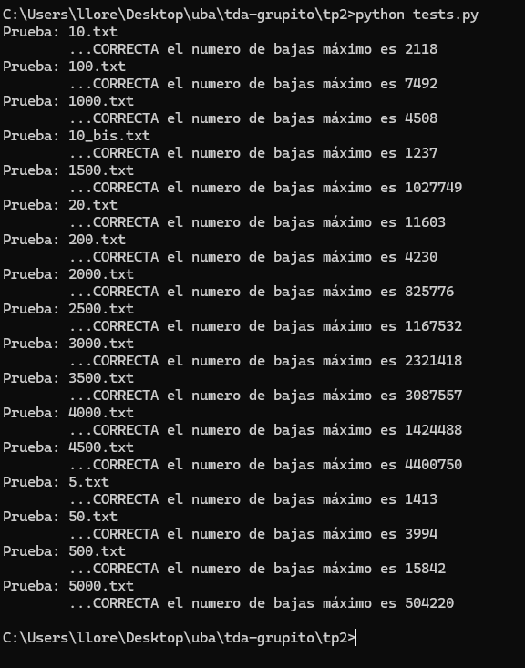

# Trabajo Práctico 2

# Reglas de uso y como correr el TP

## Para ejecutar sobre un archivo específico

Para utilizar el programa se debe ejecutar en la terminal el siguiente comando, especificando el path al archivo al cual que se le quiere realizar el algoritmo:
```sh
python main.py set_pruebas/5.txt
```
El formato del archivo de test debe ser el mismo que el dado por las pruebas de la cátedra, es decir la primera línea es un comentario, luego la segunda indica la cantidad de minutos a considerar (n). Luego vienen n líneas que corresponden a los x_i, y luego los n valores que corresponden a la función f(.), por ejemplo:

```sh
# La primera línea indica la cantidad de minutos a considerar (n). Luego vienen n líneas que corresponden a los x_i, y luego los n valores que corresponden a la función f(.):
5
271
533
916
656
664
21
671
749
833
1543
```


## Para ejecutar pruebas

Para agregar una nueva prueba al set de pruebas, se debe crear un nuevo archivo de texto con el formato mencionado anteriormente en la carpeta `set-pruebas`.

Para la ejecucion de todas las pruebas en el directorio `set-pruebas` se debe correr el archivo `tests.py`, el cual mostrará por consola los resultados de cada prueba dependiendo de si cada set de prueba calculó correctamente el máximo de cada batalla. Se puede ejecutar de la siguiente manera: 

```sh
python tests.py
```

### Ejemplo de ejecución

